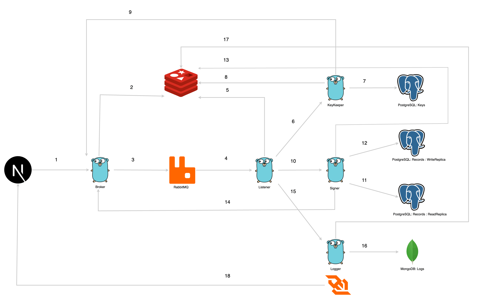

# Record Signing Service

## Overview

Record signing service leveraging a message-driven / microservice solution. 

For example, for a database of 100,000 records and a collection of 100 private keys,  the service concurrently signs batches of records, and it stores the signatures in the database until all records are signed.

## General characteristics:

- **No Double Signing**: Only one signature per record should be stored. Signing of each record is individually in batches of a configurable size.
- **Key Usage**: Any given key in the keyring is not used concurrently. A single key is used for signing all records in a single batch.
- **Key Selection**: Keys are selected from least recently used to most recently.
- **Batch Size**: It is configurable by the user and remains unchanged during runtime.

## Architecture

Designed a solution leveraging five microservices:

1. **Broker**:
    - Exposes endpoints for clients.
    - Handles requests from the frontend.
2. **Listener**:
    - Manages messages from RabbitMQ.
    - Directs messages to the appropriate microservice: KeyKeeper, Signer, or Logger.
3. **KeyKeeper**:
    - Responsible for fetching keys from a storage (e.g., PostgreSQL).
4. **Signer**:
    - Signs records concurrently.
    - Uses Golang's concurrency tools: goroutines, waitgroups, and buffered channels.
5. **Logger**:
    - Handles logging of all events.
    - Exposes a WebSocket for real-time streaming of log data.

### Workflow

1. Customer/frontend sends a request to the Broker.
2. Broker verifies if the requested data exists in Redis.
3. If needed, Broker pushes information to RabbitMQ.
4. Listener processes RabbitMQ messages and redirects based on the message type.
5. Listener interacts with Redis.
6. KeyKeeper fetches keys.
7. Key data is cached in Redis.
8. KeyKeeper notifies Broker for signing readiness.
9. Broker communicates with RabbitMQ for signing message. This is then sent to the Signer microservice.
10. Signer retrieves records from the read replica.
11. Signer saves signed records to the write replica.
12. Signer maintains a count of record status.
13. Signer communicates with the Broker for logging.
14. Logging messages are handled by the Logger.
15. Logger stores logs, e.g., in MongoDB.
16. Logger updates metrics in memory storage.
17. Logger streams metrics to the frontend via WebSocket.

